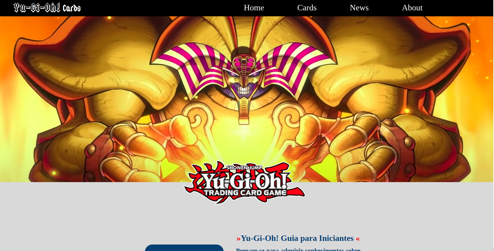
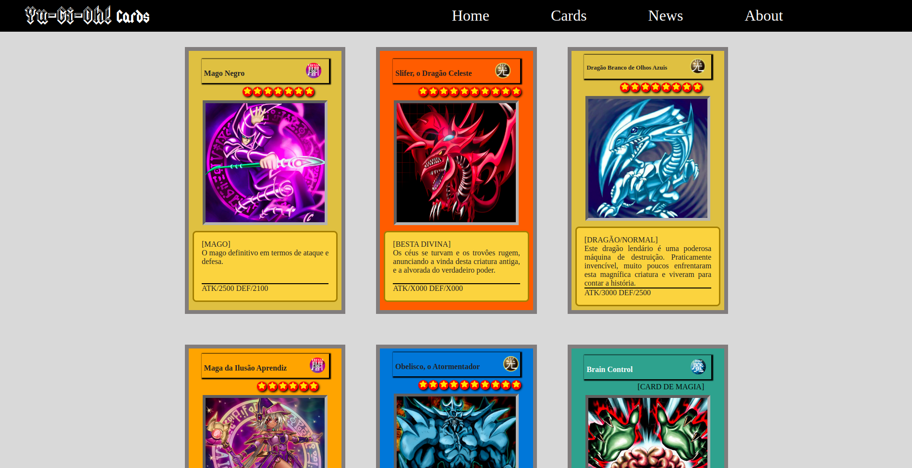

# 🃏 Yu-Gi-Oh! Cards Project


# 🔍 Explore a Aplicação em Funcionamento

Convidamos você a explorar a aplicação **"Yugioh Cards"** em sua versão online: 

[](https://denissonpereira.github.io/yugioh-cards/)

# 📑 Sobre o projeto 

O site **"Yugioh Cards"** é uma aplicação front-end apaixonadamente desenvolvida por um fã entusiasta do anime **Yu-Gi-Oh!**. Porém, é importante esclarecer que este site não representa uma entidade real associada à franquia, mas sim um projeto concebido para fins didáticos e de demonstração. Todas as cartas presentes no projeto foram criadas de forma original pelo autor, refletindo seu interesse e dedicação à série. Este projeto oferece aos usuários uma experiência interativa e educativa, proporcionando uma visão única das cartas do universo **Yu-Gi-Oh!**, mas é fundamental compreender que não está vinculado oficialmente à produção ou distribuição da franquia.

## 📸 Visuals and Screenshots

Dê uma espiada nas imagens abaixo para ter uma prévia visual do projeto em ação. As capturas de tela oferecem um vislumbre das principais características e do design envolvente.

### 💻 Layout web
 

 

### 📱 Layout mobile
 

## 📚 Stack Tecnológica

[](https://vitejs.dev/)
[](https://react.dev/)
[](https://reactrouter.com/)
[](https://www.w3.org/html/)
[](https://sass-lang.com/)
[](https://www.typescriptlang.org/)
[](https://nodejs.org/)
[](https://react-bootstrap.netlify.app/)


## 🌐 Implantação em produção

- Web: `GitHub Pages`

# 🚀 Como executar o projeto 🚀

## ⚙ Pré-requisitos

Você precisa ter o npm instalado em seu computador. O npm está disponível com o NodeJS, e para baixá-lo, basta clicar no link abaixo:

[](https://nodejs.org/en) 

Após instalar o npm, instale as dependências do projeto com o seguinte comando no seu terminal:

```
npm install
```

## ✨ Tudo pronto! ✨

Agora basta executar o projeto com o comando:

```
npm run dev
```

Aguarde a conclusão da compilação e vá para http://localhost:5173/Cifra-Magica após o término da compilação.

## 🚨 Aguarde! Ainda não terminou!

>O projeto está atualmente em desenvolvimento, e é importante ressaltar que este site não representa uma entidade real associada ao universo de Yu-Gi-Oh! É uma iniciativa independente criada por entusiastas da comunidade, dedicada a fornecer uma plataforma aberta para todos os interessados em cards de Yu-Gi-Oh!

>Queremos destacar que qualquer pessoa está livre para usar e participar deste projeto. Não há restrições de acesso ou contribuição. Seja você um jogador casual, um colecionador ávido ou um desenvolvedor apaixonado, todos são bem-vindos para colaborar, compartilhar ideias e contribuir para o crescimento coletivo do nosso espaço dedicado aos cards de Yu-Gi-Oh!

## 📜 Licença

[](https://github.com/DenissonPereira/yugioh-cards/blob/main/LICENSE) 

## Autor

Denisson Pereira Santos

https://github.com/DenissonPereira
